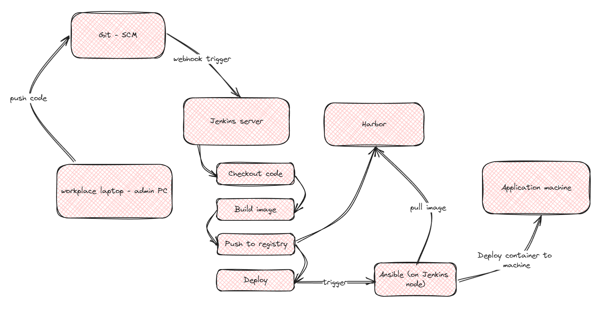
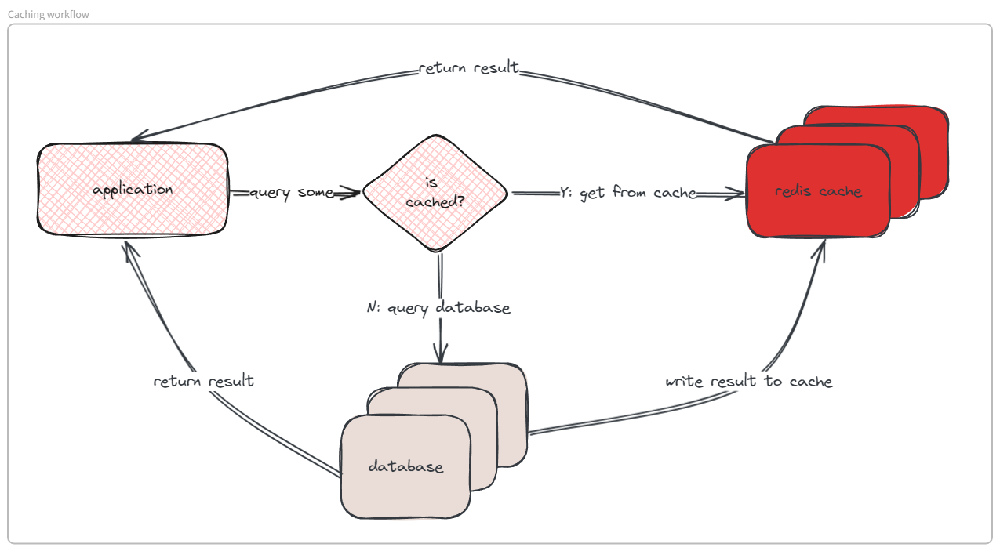

#Application #Python #Flask

- # Back to navigator: [Table of contents ](./Journal%20001%253A%20DevOps%20101.md)
- # 1. Choosing a framework
  For convenient, a fast, easy-to-approach coding language should be chosen. There are several famous candidates: JAVA, Go lang and Python.
  Because job of a DevOps Engineer will involve in scripting, Python is the one to be picked.
  With Python, there are some framework with sizeable library for coding, programming a web application with a little effort. 
  Consider these two options:
	- Flask
	- FastAPI
  In this journey, application will be written with Python Flask framework because Flask has library for handling connection with MySQL cluster, Redis sentinel and some interesting stuffs that not required deep knowledge of web programming.
- # 2. Anatomy of a Flask application
  Like any other programming language, there is a "recommend" structure for Flask application. Follow this standard outline will help coding progress and debugging progress more easy and clearly.
  The only thing you must care is ensure libraries are all installed.
  For directory tree, refer to this [Sample directory tree](Application/README.md)
  Spend a few minutes in directory, you will have some questions, so here is the explanation:
	- ``app.py`` is the executable file of application, when application runs, python will find and run this file.
	- ``__init__.py`` is the "setup" file of this application, all the methods, libraries, variables, objects will be called and declared in this file.
	- ``model`` directory holds information about objects of this application. For example, a Human resource application will have some objects like "employees", "departments", "roles",... These are objects stored in that directory.
	- ``views`` directory holds the code of displayed pages (homepage, create department page, login page,...)
	- ``base.html`` is the common holder for every pages of this application.
	- ``templates`` holds static contents as well as ``.css`` file for styles.
	- ``instance`` holds the current environment variables or secrets of deployment (should not be included in version control).
	- ``config`` will instruct ``__init__.py`` where to get variables attributes or global properties (Behavior of the Redis cache, IP of MySQL cluster,...).
- # 3. Begin the coding time
	- Before we begin, there are several packages are needed to be installed on machine. Recommend OS is Linux. If these packages are not present, these commands can install them:
		- ```sh
		  sudo apt-get update
		  sudo apt-get install -y python3 python3-pip python3-venv
		  ```
		- ``python3`` is the package of Python programming language, from Ubuntu 22, this will be pre-install on your machine.
		- ``python3-pip`` is the name of PIP, a package manager for Python, like ``helm`` of Kubernetes or ``apt`` of Ubuntu.
		- ``python3-venv`` is the package allows creating a virtual environment for Python application without harming host machine.
		- ``flask`` is the main framework of this application, in addition, ``flask-caching``, ``sqlalchemy`` should be installed too.
		- ``pymsql`` is no longer supported, so it needs some workaround like import another lib and mapping it to replace ``pymysql``.
		- The connection string from application to database should be like this:
		- ```python
		  MYSQL_CONNECTION_URL="pysql+mysql:<username>@<password>:<address_of_database>:<database_port>:<database_name>""
		- Because the username application uses to connect to mySQL and the authentication string are stored in plain text, vault or any tool to encrypt and protect them are recommend.
		- It is recommend to create the database begin the migration of application (that is, before you run application the first time).
			```SQL
			CREATE USER 'application_account'@'%' IDENTIFIED BY 'password';
			CREATE DATABASE application_database;
			GRANT ALL PRIVILEGES ON application_database . * TO 'application_account'@'%';
			```
		- Execute this command to begin the migration progress, Flask will create the database for you.
			```bash
			flask db init    # init the database object
			flask db migrate # create migrate event
			flask db upgrade # execute to database
			```
		- Show the database after these conmand.
			```SQL
			USE application_database;
			SHOW TABLES;
			+------------------------+
			| Tables_in_dreamteam_db |
			+------------------------+
			| alembic_version        |
			| departments            |
			| employees              |
			| roles                  |
			+------------------------+
			```
		- To run the application, follow these steps:
			```sh
			EXPORT FLASK_CONFIG=development
			EXPORT FLASK_APP=run.py
			flask run
			```
			
- # 4. Shipping the application to machine(s)
	- Normally, using a single command ``flask run`` is enough to bring our application into work, but what will happen if we have to update it across multiple servers? It will be an impossible task due to its time consuming and easy to make mistakes.
	- The easiest way to approach is: build a simple CI/CD workflow based on Git-Jenkins-Ansible-Docker.
		- **GIT**: The famous SCM, versioning, collaborating,...
		- **Jenkins**: CI/CD tool written by Java, strong support for **GIT**.
		- **Ansible**: Configuration management, using for setup machine, deploy application (on limited scale).
		- **Docker**: A runtime for containerization application, create a fully (or nearly full) isolate environment for application, sharing the same kennel with your OS but will encapsulate application to not make any changes on host machine.
		- {:height 497, :width 948}
- # 5. Troubleshooting
	- ## 5.1 Common case(s):
		- **Library is not supported anymore**
			- Currently, there is only 1 library on this guide is frozen, that is PyMySQL (or something like that...). The solution is quite simple and has been mentioned above. Just install an alternative (or two if you like) and mapping it to the libraries declaration in ``__init__.py`` file like this:
			- ```python
			  import some_library as missing_library
			  ```
		- **Not a flask application, missing environment...**
			- This error causes by one of these reasons:
				- Environment variables are not set. There are two important variables ``FLASK_CONFIG`` and ``FLASK_APP`` that needed to be set. The first will instruct the application load the correct profile of configuration. The second will instruct which file to be execute.
				- Not activated virtual environment. This can cause libraries are missing, because all libraries you installed are just existed in ``venv``
		- **Cannot connect to database**
			- This will result in ``HTTP: 500`` when you access the application on browser. There are some root cause (which I have been experienced before):
				- Error from endpoint, your application cannot reach the endpoint of Database. Check the diagram ((6671ad8a-38c0-4782-9fa6-fe77c4c58556)), the error can be cause by HA proxy, keepalived or simply, your host's firewall.
				- Your database is not running yet.
		- **Caching error**
			- This error will not make the application inaccessible or throw an exception to the client but in the application's log instead.
			- Caching in these scenario is often for storing result of some complex queries. When these queries are executed again, the application will retrieve for cache and not wait the database to return the result. Since this application is handler by Flask and MySQL Alchemy, a fully supported framework, some queries with inner join, left join, join... are impossible to cache (with my current knowledge about software development, that is).
				- 
	- ## 5.2. Other case(s)
		- TBA
- # 6. Containerization
	- ```Dockerfile
	  ```