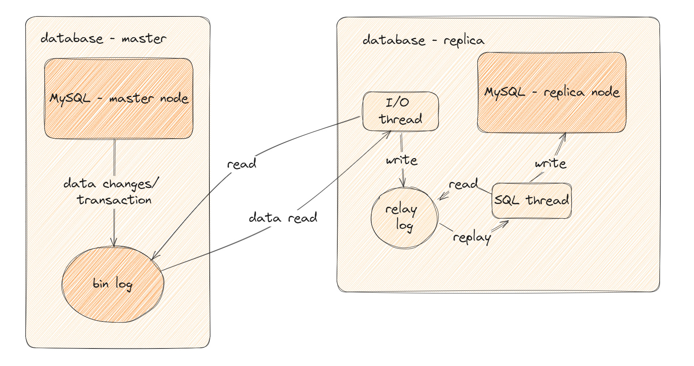
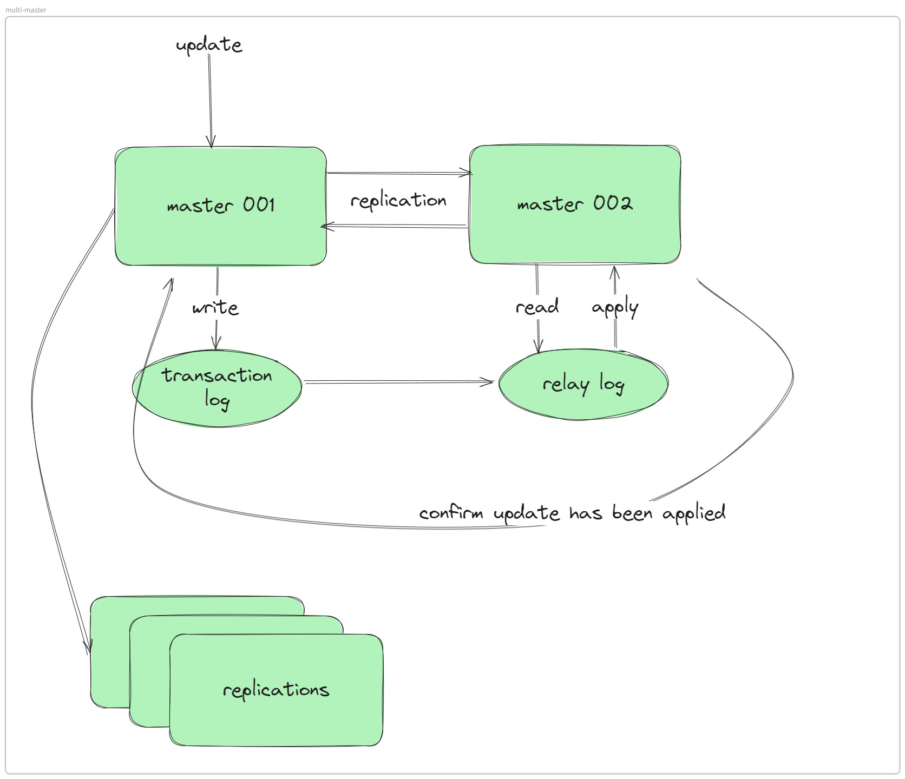
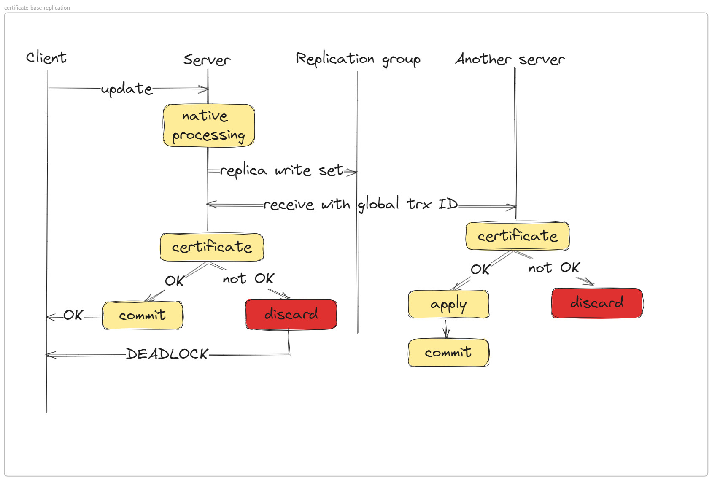
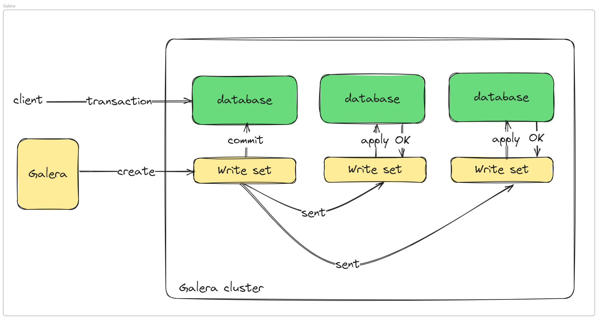

#Database
  # Back to navigator: [Table of contents ](Journal%20001%253A%20DevOps%20101.md)
  # Pre-requisiste: [Replication method](What%20is%20replica.md)
  # 1. Database problem
  As usual, database is used to store a large amount of data. In general programming, or "playground" coding, we are care little about database, because that only needs some variables, arrays or something. But in the production environment, data is stored to a database.
  Monitoring and provisioning database is a critical process can take about 40% percent of an application succession. The role for this job is called DBA, database administrator, but now, database administration not only DBA's responsible, it falls to DevOps engineer.
  # 2. Database replication
  There are some criteria that need to ensure about database.
  - It must be high availability, which means, if a disaster occurs, the database server will still online to handle requests from clients.
  - Data consistency, even if server is down and recovered after that, data will not be lost (and should not be overwritten by false value too).
  
  So, what's exactly "database replication"?
  **Replication**: is a process that every data will be copy synchronously or asynchronously for a source to a number of replicas and, in that process, all server (source and replicas) must have the same dataset. Every transaction (or changes) that executed on source (or writer) must been replicated on every nodes too.

  There are a number of ways to replicate a database, but which to choose depend on the application and infrastructure as well. Here is a list of commonly used replication method.
    - Master - slave replication: This replication is the domaint way of database replicating method with a master and many slaves. Asynchronous is usually implement.
    - Multi master replication: Many masters and slaves. Write operation can be executed on any masters, with a little delay (all master should be acknowldeged the transaction before applying it), all will be commit as usual.
    - NDB: To-be-added
  
  Furthermore, we can classify replication method with protocol, like synchronous and asynchronous, semi-synchronous,...

  Into the deep of replica model...

  ## 2.1 Master - slave model
  **Definition** This is the most dominated model in morden day. It consists 1 master server act as the source and responsible for write opertaion. Any replicas will be used for read only operation.

  

  As the illustrated above, the master node wil "extract" all the upcoming transaction (which have been executed successfully and written to log) to binlog file. The replicas will try to retrieve the bin log from master (after a short delay since it is asynchronous) and pass it to relay log. SQL thread of replica will read the relay log, replay the transaction and apply it. The replica will send a notification to master that it has completed the replication progress.
  Important parameters to monitor in replication progress:
    ``second_behind_master`` or ``replica_lag``: indicate the position of "current" slave with current position of master. When replication progress is happening, the replica will read the relay log from a specific position of a specific binlog file setup earlier, it will compare with current position of binlog from master to begin replicating. Second behind is zero means the replicas have the dame dataset with master.

  **Pros:**
  - Easy to setup, since only one master, all setup across replicas will point to that one, no needs to worry about command, syntax,...
  - Provide a reliable setup of replication, all data in master/source will be copied and executed into replicas after a short delay (asynchronous) or nearly immediately (synchronous).
  - High performance for read operation.
  
  **Cons:**
  - Single point of failure, if the master is donw, there is a small (or large) downtime, all depends on how quickly a replica is promoted to master.
  - As a result, data in the period from master down to new master promoted is lost (if client continues sending new data). And, when the "old" master rejoins the cluster, the "unexpected" data it received before crashing is still present.
  
  Till now, master slave is still the dominant method of database replication because it is reliable and suited for many kind of applcation.

  ---

  **Configuration**
  This is the instruction to setup replication between two server, 1 master and 1 replica.

  - Turn of writing on all databases, if this is "fresh", "just installed" database, this step is not necessary. 
    ```SQL
    SET @@GLOBAL.read_only = ON;
    ```
    This command with ensure all on-going transaction will be commited (finish) or rollback and no further transaction will happen.
  - For better preparation, shut down the database as well, can use ``mysqladmin`` of simply the ``service`` command of Linux OS.
  - Edit the configuration file of MySQL service as the following, adding options are not necessary but add it depends on user's need.
    ```conf
    [mysqld]
    bind-address                  = 0.0.0.0   # allow MySQL bound to all interface or just public IP for external reach
    port                          = 13306     # custom port of MySQL
    log_error                     = /var/log/mysql/error.log  # location of error log
    log-bin                       = mysql-bin                 # prefix of MySQL bin log
    server-id                     = 1                         # set the server unique id, mandatory with binlog replication
    binlog-format                 = row                       # can be set as statement or mixed
    gtid_mode                     = on                        # replica with GTID
    enforce-gtid-consistency      = on                        # ensure GTID consistency, all ID will be applied only once
    ```
    - The above configuration is a sample for setup two MySQL server in master-salve architecture. Replica is done by using GTID method
  
  ## 2.2. Multi-master model
  **Definition** This method allows multi write to multi master at a time. With this feature, longer respond time is oblivious. Every time a write from client is executed on a master, all the remaining masters will receive that transaction as well, when all masters apply successfully, they will send "ack signal" (acknowledgement) to original master (which received the transaction), after that, transaction is considered as commited.

  

  In above illustrator, a master will have a set of replicas with the same role as single "master-slave" model. All read will be preformed in replica set.

  **Pros**
  - This model is suited for collaboration platform where handles multi write requests at the same time but requests consistency. Some famous examples are: Git, Office 365, Google Docs,...
  - A transaction will be considered as successfully executed when all nodes acknowledge it and applied it, data consistency of this model is higher than single master model. At any time, all servers always have the same dataset.
  - High performance of write operation.
  
  **Cons**
  - "Split brain" is a common case in this architecture. When a master is down, cluster will continue working as usual but when the node is healthy again and rejoin the cluster, if it have more data than the exisiting dataset, conflict will happen.
  - Increase point of failure, when many master nodes are reside at the same subnets (virtual) or same data center (physical), chance of system down is increased.
  - High respond time. Because it is requires all nodes to acknowledge transaction, respond time will increase rapidly. It will likely increase as a multipler of the number of master node.
  
  ---

  **Configuration**
  This configuration is for setting up a master-master relationship between two MySQL servers. Server 1 will be master and slave of server 2. Server 2 will be master ans slave of server 1.

  - As the same as single master, the first step is stop all on-going transaction, take a backup (for recovery) and shutdown the database.
  - Setup these parameters in configuration file
    - master 1:
        ```conf
        [mysqld]

        server-id               = 1
        log-bin                 = "mysql-bin"
        relay-log               = "mysql-relay-log"
        auto-increment-increment= 2
        auto-increment-offset   = 1
        replicate-same-server-id= 0
        net_read_timeout        = 5000
        net_write_timeout       = 5000
        ```
    - master 2:
        ```conf
        [mysqld]

        server-id               = 2
        log-bin                 = "mysql-bin"
        relay-log               = "mysql-relay-log"
        auto-increment-increment= 2
        auto-increment-offset   = 2
    replicate-same-server-id= 0
        net_read_timeout        = 5000
        net_write_timeout       = 5000
        ```
    
  - There are some parameters that needs to be paid attention to.
    - First: ``server-id`` this is some sort of ID of server, help server indetifies each other.
    - Second: ``auto-increment-increment`` this is an important parameter. All transaction will be indexed in binlog and their id must be different, if not, collision will happen. For example, between 2 master, 1 master will write records with id: 1,3,5,7 and the other will be 2,4,6,8, otherwise, replication process will be corrupt (due to overwrite). Along with this parameter is ``auto-increment-offset`` is the step between 2 records (in a server).
    - Last: ``replicate-same-server-id``  avoid loop in replication. Does not replicate records that originate from same server
  
  # 2.3. Multi master wil Galera cluster
  In mutli-master scenario, "split-brain" is a common error. Moreover, conflict between nodes must be resolve (this will likely happend when a transaction is not complete but another write request is sent to master nodes). To aviod these errors, some work-around from DBA is necessary, or some tools, solutions can resolve this.
  One of the common tool to overcome these errors is Galera.
  Galera is a cluster control tool which can control MySQL servers and transforms MySQL cluster into a real multi-master cluster in nearly synchronous way.

  

  Galera works base on "certificate-base-replication". As in above illustration, everytime a transaction comes from client, it will be put into a writeset, where it will be inspected carefully and all nodes will perform analysis process to make sure if this transaction is applied, it will not cause any conflict across the cluster, after approved by all nodes, the server (which originally receive this request) will commit it and response back to client.
  This method will avoid "split brain" and "conflict" of multi-master scenario.

  Galera does not use binlog nor GTID, it uses WSREP (writeset replica).

  

  ---

  **Configuration**
  ```conf
    [mysqld]
    binlog_format                   = ROW
    default-storage-engine          = innodb
    innodb_autoinc_lock_mode        = 2
    bind-address                    = 0.0.0.0                                               # listening address, can be public IP
    port                            = 13306                                                 # mysql port, re-map to avoid conflict with HA proxy

    # Galera Provider Configuration
    wsrep_on                        = ON
    wsrep_provider                  = /usr/lib/galera/libgalera_smm.so

    # Galera Cluster Configuration
    wsrep_cluster_name              = "mysql-cluster"                                       # custom name for cluster
    wsrep_cluster_address           = "gcomm://172.16.98.102,172.16.98.103,172.16.98.104"   # a set of all node's IPs

    # Galera Synchronization Configuration
    wsrep_sst_method                = rsync

    # Galera Node Configuration
    wsrep_node_address              = "172.16.98.102"                                       # current node's address
    wsrep_node_name                 = "mysql-node-001"                                      # current node's name
  ```

  # 3. NDB with MySQL

  Sketch of NDB with 4 data nodes and 2 mysql nodes

  ```sql
      +---------------------+
      | Management Node (MGM)|
      +---------------------+
               |
               v
      +---------------------+
      |       Network       |
      +---------------------+
               |
               v
      +--------------------+    +--------------------+
      |    SQL Node        |    |     SQL Node       |
      | (MySQL Server)     |    |  (MySQL Server)    |
      +--------------------+    +--------------------+
                 |                     |
                 v                     v
          +---------------------+ +---------------------+
          |     Data Node 1     | |     Data Node 2     |
          |       (NDBD)        | |       (NDBD)        |
          +---------------------+ +---------------------+
                    |                     |
                    v                     v
          +---------------------+ +---------------------+
          |     Data Node 3     | |     Data Node 4     |
          |       (NDBD)        | |       (NDBD)        |
          +---------------------+ +---------------------+
  ```

  Components of NDB (Network database)
  - **Management node - MGM**: Does not contain any data itself, manages configuration and monitoring the cluster. Handle node failure, start, stop node, provide interface for administrator tasks. The daemon ``ndb_mgmd``
  - **Data node - NDBD**: Storing and managing the data in the cluster. There are two ways of storing data, on disk or on memory, on disk is recommend if the dataset is large, internal memory is expensive to use for this kind of tasks. This node will handle data distribution, data partitioning, data replicating,... The daemon of this node ``ndbd`` of ``ndbmtd`` depends on version of NDB software.
  - **Mysql node - MYSQLD**: This node with MYSQL client install is repsonsible for connection from application. The daemon ``mysqld``.
  - **API node**: This node allow direct API call to database without using SQL, depends on situation to construct this node.
  
  ## 3.1. Data storage/ partition/ fragement in NDB

  Data in NDB is stored into partition (or fragemented).
  - A table with its data will be distributed across all nodes of cluster. The primary key of table will determine which partition go to which node.
  - For example, if the database has 1 table and 3 nodes, each node will container one-of-third of the table.
  - NDB is redundancy, which means in every node, a replica of other nodes are present. This diagram will illustrate more clearly:
  ```sql
  +----------------+     +----------------+     +----------------+     +----------------+
  |    Node N1     |     |    Node N2     |     |    Node N3     |     |    Node N4     |
  |                |     |                |     |                |     |                |
  |  Fragment 1    |<--> |  Fragment 2    |<--> |  Fragment 3    |<--> |  Fragment 4    |
  |  (Primary)     |     |  (Primary)     |     |  (Primary)     |     |  (Primary)     |
  |  Fragment 4    |     |  Fragment 1    |     |  Fragment 2    |     |  Fragment 3    |
  |  (Secondary)   |     |  (Secondary)   |     |  (Secondary)   |     |  (Secondary)   |
  +----------------+     +----------------+     +----------------+     +----------------+
  ```

  - A specific table is divided into 4 fragements, each will lie on a node of this cluster and this will have an additionaly replica in other node (in production, almost every node all have replica of other nodes).
  - When node N1 is down and fragement 1 is lost, the management node will handle fail over process, the replica on node N2 will take over the role as the main data of fragement 1, ensure no data losing.
  
  ## 3.2 Data storage mechanism
  - Location: data is stored on data node of cluster.
  - Data can be stored both in-memory and on disk.
  - It is further divided into these components:
    - **Memory buffer**: ``DataMemory`` stores actual data rows and ``IndexMemory`` stores indexes.
    - **Disk storage**: ``DataDisk`` for storing huge size data, ``RedoLogs`` captures all changes to the data for recovering purpose, ``UndoLogs`` for rolling back transactions in case failure.
  
  ## 3.3 Advantages and disadvantages
  
  **Adavantages**
  - *High availability*: Data is replicated across all nodes, if failure occurs, data is not losing.
  - *Automatic failove*: Because of data partitioning, if a node fails, another node can take up the down node immediately with exactly the same dataset.
  - *Scalability*: More nodes can be added into cluster to improve performance. Traffic between nodes can be handle in a distributed way.
  - *Performance*: With in-memory storage, accessing to data takes less time.
  - *Fault tolerance*: Data is redundancy, always available and cosistent.
  - *Distribution*: Can be setup across multi datacenter.
  
  **Disadvantages**
  - *Complexity*: It is hard to setup and maintenance with a number of nodes to monitor which with different roles and hardware requirements.
  - *Resource consumption*: Require bandwidth to communicate with other nodes, with MySQL node and with management node. Require resources for in-memory storage, and disk space if data set becomes too large.
  - *Limited support*: It is not InnoDB or MyISAM enine.