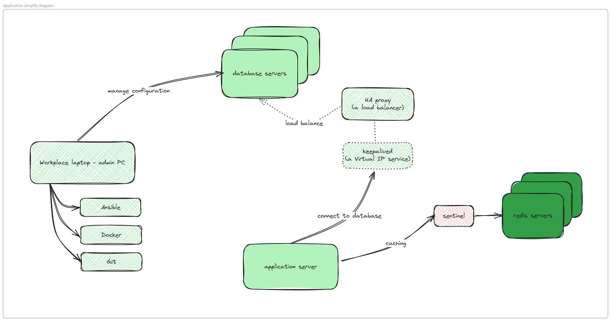
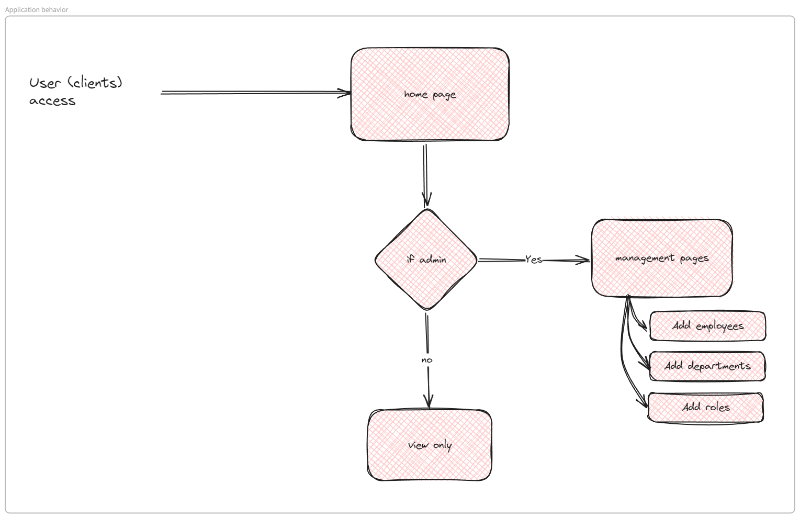

# Pre-word
This is a journal about constructing a fully running application from scratch to a full stack include database, cache, automation deployment, automation integrated, version control, logging and monitoring... In conclusion, all stacks that a DevOps engineer need to know.
- # Diagram of this project
  id:: 6671ad8a-38c0-4782-9fa6-fe77c4c58556
	
- # Application expected behavior
	

- # Database structure
	![[database-structure.png]](../Figures/database-structure.png)

- # Caching cluster
	![[caching-cluster.png]](../Figures/caching-cluster.png)

- # Software stack
	![[software-stack-per-machine.png]](../Figures/software-stack-per-machine.png)

- ## Chapter 1: [Construct a simple CRUD application](./Construct%20a%20simple%20CRUD%20application%20from%20scratch.md)