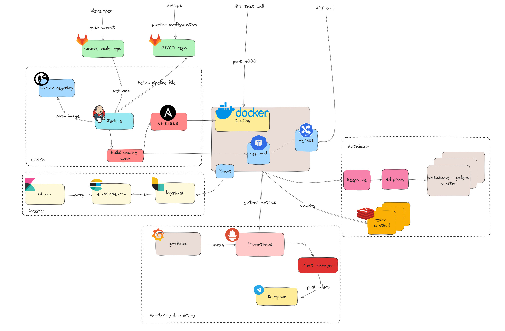

# Mục lục

1. [Lời nói đầu](#lời-nói-đầu)
2. [Phân tích đề tài](#phân-tích-đề-bài)
3. [Mô hình đề tài](#mô-hình-của-đề-tài)
4. [Tham khảo](#tham-khảo)

# 1. Lời nói đầu
  Đây là một bài tập có thể gọi là nhập môn của DevOps, bài này sẽ bao gồm nhiều phần, những phần đó sẽ cấu tạo nên một dự án hoàn chỉnh mà các bạn có thể gặp trong môi trường làm việc thực tế.

  Đây là đầu bài đầy đủ:
  
  ***Thực hiện triển khai một web application đơn giản lên môi trường container hoặc VMs với luồng CI-CD đầy đủ. Trong đó, ứng dụng có đảm bảo việc sử dụng database và dùng cache. Có thiết lập build ứng dụng tách biệt môi trường testing và production (đánh tag hoặc đánh version theo định nghĩa đầy đủ). Có triển khai tầng monitoring và alerting.***

# 2. Phân tích đề bài
  Như các bạn thấy, đề bài có những yêu cầu cơ bản và có thể tách thành các khối (block) sau đây:
  - Application block: Ứng dụng là dạng web application, khuyến khích mọi người dùng Python Flask hoặc FastAPI cho nhanh, ứng dụng chỉ là dạng CRUD đơn giản là được. Yêu cầu với block này:
    - Có API để ghi, lấy dữ liệu từ database.
    - Có API đọc ghi vào cache.
    - Có API healthcheck đơn giản.
  - Database block: Khối CSDL, khối này bao gồm cả CSDL chính của ứng dụng, dùng để lưu trữ thông tin người dùng cũng như các dữ liệu khác và cache. Yêu cầu thiết kế của khối là đảm bảo tính HA. Để biết tính HA là gì, tham khảo [HA](../Eng/How%20to%20setup%20a%20HA%20database%20cluster.md) (cho bản tiếng Anh). Yêu cầu
    - Có tính HA.
    - Auto failover.
    - Hiểu được các mô hình replica phổ biến cho CSDL
  - CI-CD block: Khối tích hợp và triển khai. Đây là khối đảm bảo tính tự động hoá cho ứng dụng. Với mô hình ứng dụng truyền thống, mỗi khi cần triển khai phiên bản mới, system admin có thể phải tự làm các công việd (hoặc SRE - Software Release Engineer) từ chạy lệnh build cho đến start stop application thủ công, cập nhập phiên bản rồi restart lại servers chẳng hạn. CI/CD giúp giảm thời gian cho quá trình này và làm nó đơn giản hơn. Yêu cầu
    - Có build Images và tag tuỳ theo môi trường (PRD hoặc Testing).
    - Triển khai dạng kubernetes (container).
  - Logging: Đây là khối tập trung tất cả các logs của service (application) hoặc là hệ thống servers. Thường thì khi chưa dùng hệ thống quản lý Logs tập trung, chúng ta cần thiết phải vào từng server và đọc từng file logs, có hệ thống này thì việc trace logs sẽ đơn giản hơn.
    - Đầy đủ luồng: collector -> aggregation -> log storage -> visualizer
  - Monitoring: Khối này thì đơn giản hơn, yêu cầu cũng nhẹ nhàng hơn nhiều
    - Sử dụng Prometheus và Grafana
    - Sử dụng Alert manager để alerting

# 3. Mô hình của đề tài
  Đề tài có mô hình như sau:

  

# 4. Tham khảo
  - [Xây dựng một ứng dụng CRUD đơn giản dùng Python và Flask](https://github.com/phungh67/devops-sample-application)
  
  - [Lý thuyết về HA cho database](../../Journal/Eng/How%20to%20setup%20a%20HA%20database%20cluster.md) và [Configuration cho database](https://github.com/phungh67/devops-database)

  - Còn tiếp ...