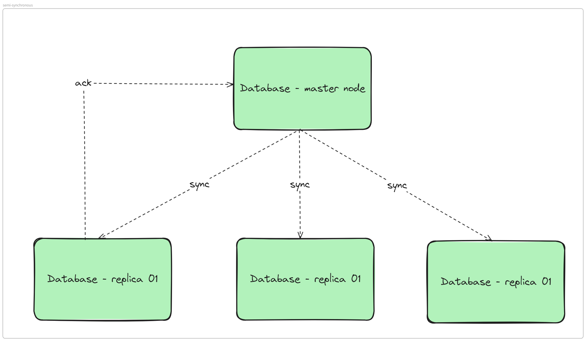

# Back to navigator: [Table of contents ](Journal%20001%253A%20DevOps%20101.md)
# Back to main topic: [Section 2](How%20to%20setup%20a%20HA%20database%20cluster.md)

  # 1. Database replication
  Refer to replication on context of database: 
  > Replication in the database context refers to the process of copying and maintaining database objects, such as tables, schemas, and entire databases, across multiple database servers or instances. This ensures that the data is consistently available in multiple locations, which can be used for various purposes such as improving data availability, fault tolerance, load balancing, and disaster recovery.

  > Replication enables data from one MySQL database server (known as a source) to be copied to one or more MySQL database servers (known as replicas). Replication is asynchronous by default; replicas do not need to be connected permanently to receive updates from a source. Depending on the configuration, you can replicate all databases, selected databases, or even selected tables within a database.
  [MySQL documentation](https://dev.mysql.com/doc/refman/8.4/en/replication.html)

  **To be short:** Replication is a process that make all your database server always have the same dataset at any point of time.

  # 2. Ways of replication
  Assume that we use InnoDB, which engine the famous ``MySQL`` used. This will refer 2 methods that are widely used to replicate data.
  - Bin log replication.
  - Global transaction ID replication (GTID).
  
  ## 2.1 Bin log position way
  - **What is the bin log?**
  Bin log is short called of binary log, a file (in text form, encoded) that contains all recored of activity of a database. These activity includes: ``DELETE``, ``UPDATE``, ``CREATE``, ``ALTER`` and ``INSERT`` or even ``DROP``.
  The bin log acts as a source for recovering, replicating and even auditing.
  - **Form of bin log**
  It has 3 types of form: 
    - Statement-based logging: Logged SQL statement into file, exclude read-only or dropped transaction. Convenient with transaction that apply to a large number of rows, columns and tables.
    - Row-based logging: Logged actual data changes (the affected rows). Will product a large data for bin log.
    - Mixed: contain statement-based and row-based. Server will decide when to use row or statement.
  - **Must set rule to rotate, remove or archive binlog for storage space**
  ## 2.2 Global transaction ID
  - **Definition**
  It is a unique identifier assigned to each transaction that is commited in a MySQL database. This is globally, so it is very easy to tracked across all nodes. Format of this ID: ``UID_of_machine:ID_of_transaction``. When an ID is assined to a transaction, it can not be changed, with this, consistency is ensure.
  - **Life cycle**
  

  - **Sample configuration**
    ```conf
    [mysqld]
    log-bin                         = mysql-bin
    server-id                       = 1
    port                            = 13306
    bind-address                    = 0.0.0.0
    binlog-format                   = row
    gtid_mode                       = on
    enforce-gtid-consistency        = on
    ```

  - **Result**
    ```sql
    mysql> SHOW VARIABLES LIKE '%gtid%';
    +----------------------------------+-------------------------------------------+
    | Variable_name                    | Value                                     |
    +----------------------------------+-------------------------------------------+
    | binlog_gtid_simple_recovery      | ON                                        |
    | enforce_gtid_consistency         | ON                                        |
    | gtid_executed                    | 50521d8a-339c-11ef-a1b9-005056b1a635:1-22 |
    | gtid_executed_compression_period | 0                                         |
    | gtid_mode                        | ON                                        |
    | gtid_next                        | AUTOMATIC                                 |
    | gtid_owned                       |                                           |
    | gtid_purged                      |                                           |
    | session_track_gtids              | OFF                                       |
    +----------------------------------+-------------------------------------------+
    9 rows in set (0.29 sec)
    ```

    ## 2.3 Notes (very important to read)

    According to my mentors, both ways are using bin log, one way uses position and on way uses GTID. It is not about using the bin log or not. Please remember that.

    # 3. Replication type of a MySQL database

    As a very popular database software, MySQL has been developed well and comes with many type of replication setup which will be fit into many different scenarios.

    ## 3.1. Traditional model: an old fashion yet dominant way

    It is formely called master slave, but with some "racist" problems, now we call it "controller - replica" model.

    This model is the simplest to achieve and the most basic one to begin with when you start to learn about database replication. In this model, just one server has the right to write data and execute data manipulation commands, the rest servers are read only, cannot make any change to the dataset as well as used for only "SELECT" command.

    

    As you see, through network connection, slave or replica will somehow pull (or percisely, the bin log of master) bin log from master to its local storage. If this step is completed, a thread called MySQL thread will read that log and write transactions it read into relay log (sounds like replay somehow). With these information, SQL thread will apply all the transactions to slave's dataset. When all changes have been applied, it will send back an ack (acknowledge) for master to notify that replication process has been done.

    This is a high level view, I have to admit that some knowledge I know maybe wrong or not 100% correct, so if you have any opinions or any advises, please pull this repository and help me complete it.

    Back to the main topic, this model is suitable for content management system or a system that requires read more that write. But in the real world, as I see and as my mentors indicate that, except some situation that need specific database architecture, 80% service will use this architecture for database.

    **Pros**:
    - Easy to update, straight forward, can use biglog position of GTID for repication.
    - Ensure data consistency, all data on the source will be available on replicas.
    - Don't have to handle data conflict when joining nodes.
    **Cons**:
    - Limited write capacitiy since only one node is allowed to execute write commands.
    - Single point of failure, when master node is down, all transaction will be refused.
    - High workload of replicas can cause high lag (second behind master) which will cause data inconsistency.

  ## 3.2. Semi-synchronous model: A model that fits will high consistency service.

  This model is pretty similar to master-slave mode, except, it always have at least (or more, if operators and developers need) 1 replica syncs with master. Which means, with every transactions happened, it must be acknowledged with that replica before applying into data set.

  In this case, it is ensured that every transaction has been applied into dataset. Imagine that you have a finance application, to ensure HA, you are setting up multi master, that allow multi write, but it has many disadvantages like "split brain", "data conflict",... so you came up with semi synchronous. Every time user calls a transaction, the master will accept it and write its dataset, normally, its binlog will be transported to replicas after a short delay (or long, depends network's conditions, depends on the size of dataset,...) But what if you want to ensure your data is available in read replicas.

  In normal master salve, the most transaction maybe unavailable on read replicas right after commit, but in this model it will be available.

  

  ## 3.3. Delayed model: A model help you rollback if any errors occur

  Before beginning, we must know that, in master slave model, the delayed time between binlog writing in master and binlog delivery on replicas is not controlled by operator, it depends on network, size, ...

  So, this is the case, what will happen if an junior or a new commer operator accidentally ``DROP`` a whole table? I's sure that would be "disaster" in term of DevOps. Of course we will need recover (yes, DevOps's mission is ensure we always have backup) but it will take time.

  So this "delayed" replication will ensure that, after a certain number of time (minutes, hours, days), the binlog will be delivered to replicas and applied. With this approach, we will have a "cold" source of data. In this case, we just need to switch traffic to replica, accept data loss instead of stopping service to wait for recovery.

  
  
  # Back to [top](#back-to-navigator-table-of-contents)