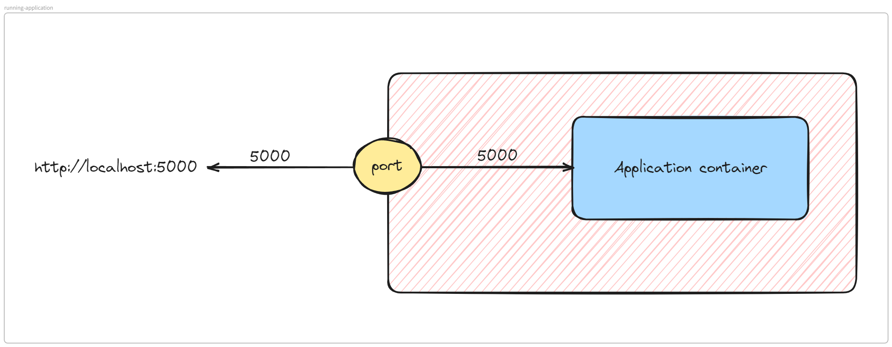

# Pre-word
Hello, this is the author of repository.
First of all, thank you for viewing my project. There are somethings about this project that you need to know before digging into it.

1. This project is constructed when I am a Junior DevOps engineer (which is still correct at the moment), so some knowledge and some methods maybe not right, if you have any ideals or any contributes, feel free to clone this repository and edit it, after all, knowledge is for sharing.
2. In this journal, "try and error" method was applied and I think this is the most appropriate for me to learn about.
3. It is recommed to read all the section, but if you want to dig in first, move to next section.

# How to make this project run:

## Needs:
- Servers, a lot, VM on local environment or Cloud, depends on your taste
- Some knowledge about Python Flask (for debugging and customized the application)
- Some knowledge about OS (just kidding, you will need at least intermediate level of Linux)
- Understand Grovy is a plus, it will help you with Jenkins CI/CD
- And a strong willpower cause you will need it

## Servers


We need at least 7 server for these roles:
- A git server with at least 4GB ram and 20GB of storage. We will create our pivate Git repository.
- A Jenkins server with at least 4GB ram and 50GB of storage. It will be used for CI/CD.
- A private image registry, using Harbor, this server can be smaller than Git, but at least 2GB ram for sufficient performance.
- 2 server with 4GB ram for monitoring, one for Prometheus + Grafana and one for ELK stack (very heavy)
- If you have a shortage, you can install MySQL, Redis in a same machine with the same above stack. As my case, I have installed Jenkins + mySQL + redis, Harbor + MySQL + redis and Prometheus + MySQL + Redis.
- It is recommend to have a separate server for deploying application. You can setup minikube as well. As my model, I using Ansible + Docker for testing and Kubernets for "production"

**So in conclusion, you need at least 7 servers. That's all. It is pretty simple if you have a powerful PC, or you can using AWS EC2, just be care full with these features AWS offered for you**

## Software stack

It is recommend to have knowledge before digging in this project:
- Docker
- Ansible
- Kurbernetes
- Python
- Jenkins
But what's if you don't know, well, we will make it through all my Journal.

# 1. Running the application on test
```sh
git clone https://github.com/phungh67/devops-journal.git
cd devops-journal/Application

pip install -f requirements.txt
export FLASK_CONFIG=development
export FLASK_APP=run.py

flask run
```



Naviage to your http://localhost:5000 and you will see your application is running. Maybe in newer version of Ubuntu and Python, it will force you to create a virtual environment to run this application. Because my application is containerization, so, it is better to do this:
```sh
docker build -t devops-journal/flask-application .
docker run -d --name flask-application -e "FLASK_CONFIG=development" -e "FLASK_APP=run.py" -p 5000:5000
```

# 2. Setup the database
If you have setup the database before of reading anyone of these pages [CRUD application](../pages/Journal/Construct%20a%20simple%20CRUD%20application%20from%20scratch.md) or [HA for database](../pages/Journal/How%20to%20setup%20a%20HA%20database%20cluster.md), you can skip this step, if not, you can setup a simple database with these command (I will give you the sample ``.sql`` backup file for quick setup)

```sh
mysql -u root -P 13306 -p
```
```sql
create flask_application;
create user 'flask'@'%' identified by 'Application@2024`;
grant all privileges on flask_application.* for 'flask'@'%';
```

```sh
mysql -u root -P 13306 -p flask_application < flask_application.sql
```

After restore successfully, your application can run normally, if not, it will display ``500: Internal server error``.

If you want to use Ansible, I will add the playbook later, but now, since it is simple, you can set up it normally

# 3. Setup the CI-CD workflow with GitLab, Jenkins and Ansible

GitLab and Jenkins should be run in containerization form for easy managing. I will update GitLab configuration as well as Jenkins custom Dockerfile.

To re-create the environment as close as production, I will create self signed certificate with local DNS. If you have advanced knowledge, create and host your own DNS server as well.


Contact: phungh67@gmail.com