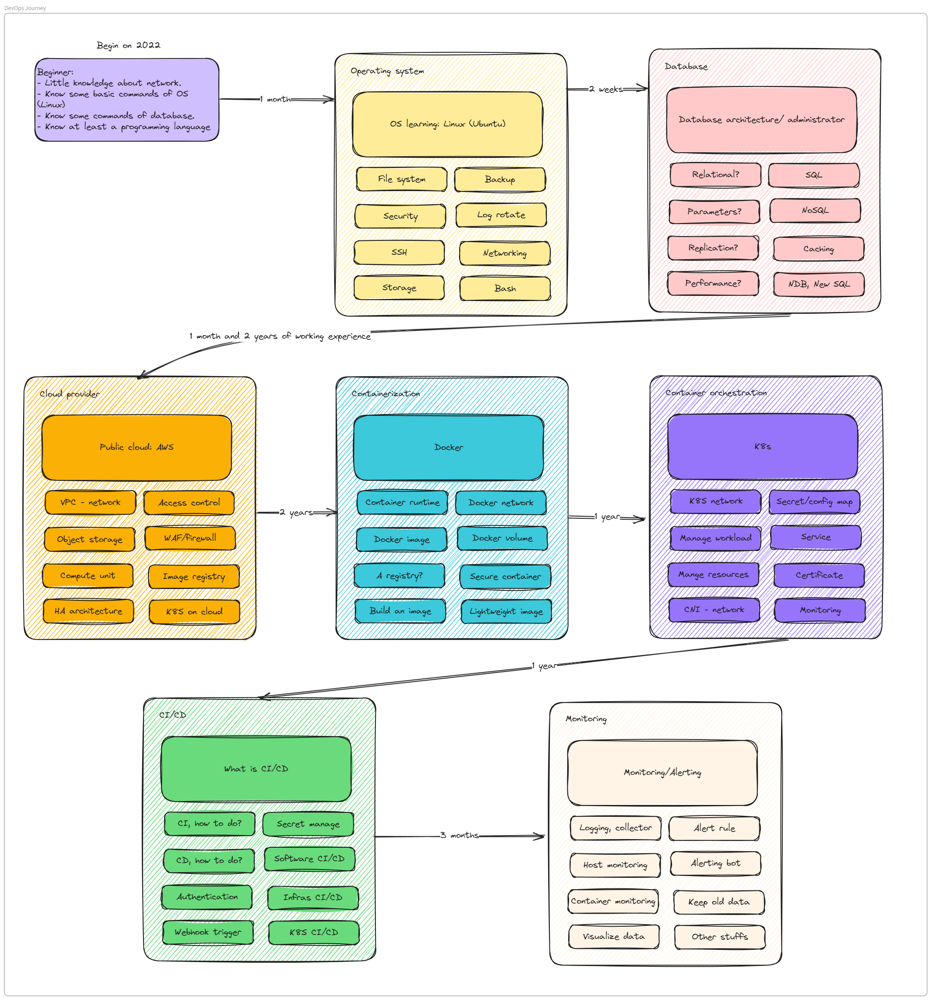

Hello, this is the author of repository.
First of all, thank you for viewing my project. There are somethings about this project that you need to know before digging into it.

**TL,DR**

**For coding** [Coding section](./Journal/Construct%20a%20simple%20CRUD%20application%20from%20scratch.md)

**For database** [Setup a MySQL cluster](./Journal/How%20to%20setup%20a%20HA%20database%20cluster.md)

**Journey map** 


1. This project is constructed when I am a Junior DevOps engineer (which is still correct at the moment), so some knowledge and some methods maybe not right, if you have any ideals or any contributes, feel free to clone this repository and edit it, after all, knowledge is for sharing.
2. In this journal, "try and error" method was applied and I think this is the most appropriate for me to learn about new things.
3. About the "structure", I think it gonna be like this:
```
root
\________ Coding_dir: For all code-related-examples
\________ Figure: For all the illustration
\________ Configuration: For all the config file I have made
		\______ Nginx
		\______ Database
		\______ HA proxy
		\______ Keepalived
		\______ ... (more in the future)
\________ Docker
		\______ Dockerfiles
		\______ Docker-compose-file
		\______ ...
\________ Ansible
		\______ Example
		\______ Templates
		\______ Playbooks
\________ Kubernetes
		\______ Manifests
		\______ Helm-chart
		\______ ...
\________ Jenkinsfile
\________ Journals: All the journal I wrote
```

So, let dig in the first step or this journey [First page](Journal/Journal%20001%253A%20DevOps%20101.md)

Contact: phungh67@gmail.com